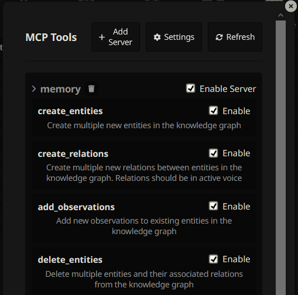

# SillyTavern 的 MCP 扩展

这是 [SillyTavern](https://docs.sillytavern.app/) 的一个 [MCP](https://modelcontextprotocol.io/introduction)（模型上下文协议）扩展。可能是解决以下问题的方案：[SillyTavern/SillyTavern#3335](https://github.com/SillyTavern/SillyTavern/issues/3335)

> **请确保仅安装可信的 MCP 服务器。**



---

## 安装

1. 前往 [服务器插件](https://github.com/bmen25124/SillyTavern-MCP-Server) 并安装。
2. 使用 SillyTavern 的扩展安装器进行安装：

```txt
https://github.com/bmen25124/SillyTavern-MCP-Client
```

3. 通过扩展菜单安装 MCP 服务器。
4. 在采样器设置中启用 `启用函数调用`。

---

## 演示

您可以通过以下链接查看演示视频或相关内容：

[点击查看演示](https://github.com/user-attachments/assets/659c5112-c2d0-425d-a6fc-e4b47b517066)

---

## 常见问题 (FAQ)

### 我可以在哪里找到更多的服务器？
[查看服务器列表](https://github.com/punkpeye/awesome-mcp-servers)。

---

### 我需要更改服务器配置，该如何操作？
点击 `设置` 按钮，使用文件资源管理器打开 `mcp_settings.json` 文件的位置。编辑该文件后，通过取消勾选并重新勾选 `启用服务器` 来断开并重新连接。

---

### 当我尝试连接到 MCP 服务器时出现错误怎么办？
请检查 SillyTavern 控制台以获取更多信息。可能的错误包括：
- 未仔细阅读 MCP 服务器的 README 文件。
- 缺少参数。
- 无效的 `env` 参数。如果需要，请设置 API 密钥。

---

如果您遇到其他问题，请参考相关文档或在社区中寻求帮助！
